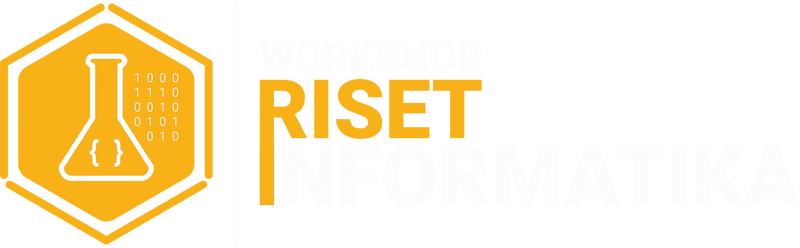
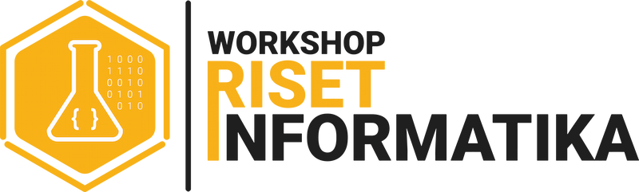

**Workshop Riset Informatika** is community that aims to help students to learn anything about information technology and other related fields.
This community is open for all students from any major in State Polytechnic of Malang. Regardless of your major,
as long as you have the passion to learn, you are welcome to join us!

This Github organisation serves as a place to keep our projects and for us to collaborate with each other. Feel free
to explore our repositories and contribute to them!

For more information about us, you can visit our [website](https://wridev.id) or our [Instagram](https://instagram.com/wripolinema).